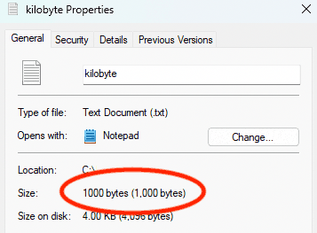
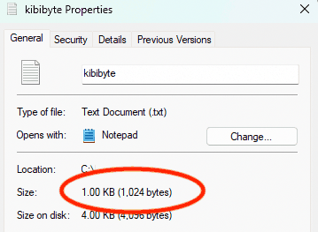

_tl;dr: either 1000 bytes or 1024 bytes, but there's no consensus._

As best I can tell, **there is no broad consensus on how large a kilobyte is.** Some say that a kilobyte is 1000 bytes while others say it's 1024 bytes. Others are ambiguous.

This also means that the industry does not agree on the size of megabytes, gigabytes, terabytes, and so on.

## To the polls

I ran an informal poll on Mastodon. 76% of the 123 votes said a kilobyte was 1024 bytes.



The majority was in the "base 2" camp, but a lot of people still voted for 1000.

But that's just random people on social media, heavily biased by the people who follow me. Surely there's consensus elsewhere?

## Online encyclopedias and dictionaries

[English Wikipedia](https://en.wikipedia.org/w/index.php?title=Kilobyte&oldid=1171999944) strongly declares that "one kilobyte is 1000 bytes", but quickly acknowledges that "_kilobyte_ instead typically refers to 1024 (2<sup>10</sup>) bytes" in some places.

At a glance, it looks like Wikipedia's other languages, such as [Spanish](https://es.wikipedia.org/w/index.php?title=Kilobyte&oldid=153432216), also acknowledge the discrepancy.

[Merriam-Webster](https://www.merriam-webster.com/dictionary/gigabyte), [English Wiktionary](https://en.wiktionary.org/wiki/gigabyte#English), [WordNet](http://wordnetweb.princeton.edu/perl/webwn?s=gigabyte), and [The American Heritage® Dictionary of the English Language](https://www.ahdictionary.com/word/search.html?q=gigabyte) also have both definitions. The [Oxford English Dictionary](https://www.oed.com/search/dictionary/?scope=Entries&q=megabyte) does not, and is in the "base 2" camp.

[Brittanica](https://www.britannica.com/technology/byte) also acknowledges the disagreement:

> ...originally one kilobyte was not 1,000 bytes but 1,024 bytes (1,024 = 2<sup>10</sup>), and thus one megabyte (MB) was 1,024 × 1,024 bytes and so on. However, with some notable exceptions such as the Microsoft Windows operating system, the computer industry has switched over to decimal prefixes, in which prefixes denote a thousandfold increase in bytes.

I'm sure I missed a few, but it seems there's no consensus with traditional online dictionaries or encyclopedias, at least in English.

Brittanica mentions Windows specifically...I wonder what happens there?

## The computer world

Looks like Britannica is right when testing on Windows 11, which indeed treats 1024 bytes as a kilobyte and 1000 bytes as, well, 1000 bytes:

<p class="flex">
  <picture>
    
  </picture>
  <picture>
    
  </picture>
</p>

[Apple Inc. mostly believes](https://support.apple.com/en-us/102119) that a kilobyte is 1000 bytes. I see this when I test on macOS 13 and iOS 17 (though I have to go up to a gigabyte to start seeing the difference). However, watchOS, old iOS, and old macOS versions are in the base-2 camp:

> The operating system of your iPhone, iPad, iPod touch, and Mac reports storage capacity using the decimal system (base 10), which calculates 1GB as 1 billion bytes. [...]
>
> iOS 10 and earlier, Mac OS X Leopard and earlier, Microsoft Windows, and watchOS use the binary system (base 2), which calculates 1GB as 1,073,741,824 bytes.

Looks like Ubuntu 23.04 treats them the same in the file explorer. There's no obvious difference between 1000 bytes and 1024 there:

<p class="flex">
  <picture>
    <source srcset="./ubuntu_kilobyte_dark.png" media="(prefers-color-scheme: dark)" />
    
  </picture>
  <picture>
    <source srcset="./ubuntu_kibibyte_dark.png" media="(prefers-color-scheme: dark)" />
    
  </picture>
</p>

Android 13 seems to think a kilobyte is 1000 bytes:


Standard Unix stuff seems to think that a kilobyte is 1024 bytes. The `du` command uses base 2 by default but can be configured. `ls -lh` and `find -size` always use base 2. For example, here's what `ls -lh` looks like:

```sh
ls -lh
# -rw------- 1 evan group 1000 Apr 20 18:09 kilobyte.txt
# -rw------- 1 evan group 1.0K Apr 20 18:09 kibibyte.txt
```

In the JavaScript world, [bytes.js](https://github.com/visionmedia/bytes.js) says a kilobyte is 1024 bytes but [pretty-bytes](https://www.npmjs.com/package/pretty-bytes) says 1000. In Python, the [humanize package uses base 10 by default](https://humanize.readthedocs.io/en/latest/filesize/) but can be configured. Ruby on Rails's [`number_to_human_size`](https://api.rubyonrails.org/classes/ActionView/Helpers/NumberHelper.html#method-i-number_to_human_size) uses base 2.

There are _lots_ more places I could look in the computer world, but it seems that there's no consensus here, either.

## How big are these differences?

The difference between 1000 and 1024 bytes is small and usually inconsequential. This sentence is longer than 24 bytes.

The differences start to add up the bigger you go.

| Unit                                      | Difference                   |
| ----------------------------------------- | ---------------------------- |
| KB (1000 vs 1024)                         | 24 bytes (~2.4%)             |
| MB (1000<sup>2</sup> vs 1024<sup>2</sup>) | ~48 thousand bytes (~4.7%)   |
| GB (1000<sup>3</sup> vs 1024<sup>3</sup>) | ~74 million bytes (~7.1%)    |
| TB (1000<sup>4</sup> vs 1024<sup>4</sup>) | ~100 billion bytes (~9.5%)   |
| PB (1000<sup>5</sup> vs 1024<sup>5</sup>) | ~126 trillion bytes (~11.8%) |

If you're buying a 1 TB hard drive, you can store a lot more movies if the seller thinks a kilobyte is 1024 bytes.

## Takeaways

I thought this was going to be pretty straightforward. It was not.

**My big takeaway: terms like "kilobyte" and "gigabyte" are ambiguous**. This might not matter ("let me send you a file, it's only about 2 megabytes"), but it might in some situations, like in a specification.

Terms like "kibibyte" and "gibibyte" are less common, but they are precise and also [cute](https://wandering.shop/@mgates/111013272060439033).

Another takeaway: be wary of simple answers to complex questions. I saw a few people confidently declare that a kilobyte is 1000 bytes—everyone else is wrong. I also saw the opposite. This ignores a lot of human nuance!

A final takeaway: on behalf of the entire industry, I want to apologize to the world for failing to agree on this extremely basic terminology.
