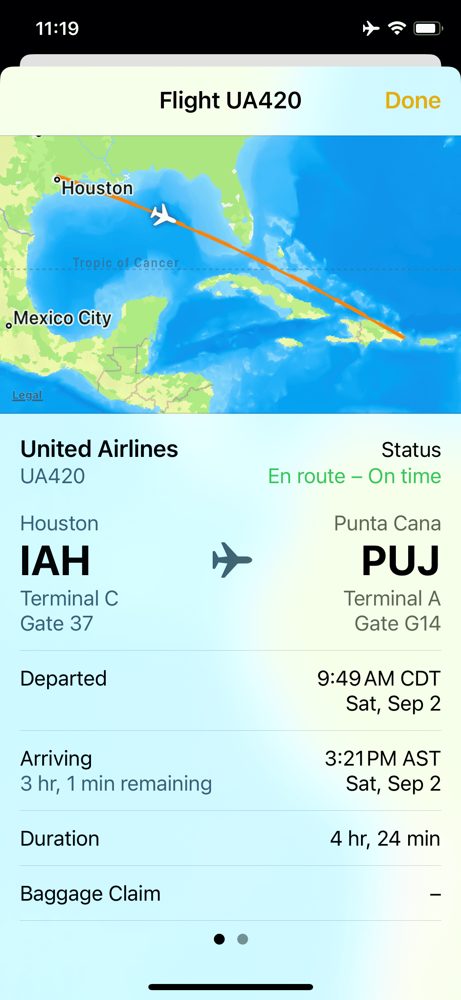

There are a lot of fancy iPhone apps for tracking flights. But if you have the flight number, you don't need to install anything.

In some apps (like Messages or Notes), the flight number will be highlighted. If you long press on the text, you can preview the flight.

  <picture>
    <source srcset="./notes_dark.png" media="(prefers-color-scheme: dark)" />
    
  </picture>
  <picture>
    <source srcset="./preview_dark.png" media="(prefers-color-scheme: dark)" />
    
  </picture>

As you can see, the preview shows the flight's status, location, and more.

This little feature prevents me from installing (or paying for) yet another app.
