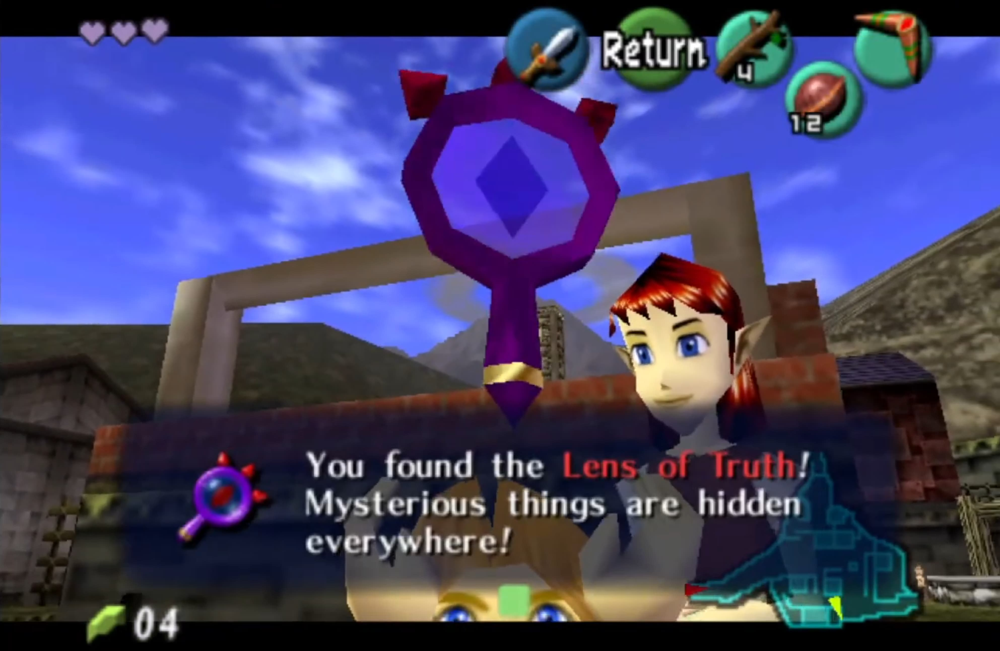

_This was last updated for randomizer version 7.1. It's intended for people familiar with The Legend of Zelda: Ocarina of Time._

I just finished my eighteenth [Ocarina of Time Randomizer][0] run. It's a blast. It shuffles everything around while guaranteeing the game is beatable. [This Kotaku article](https://kotaku.com/1832471384) gives a great summary of how it works and why it's so fun.

I'm a casual player. I don't enter races or perform fancy glitches. But there are a few things I wish I'd known when I started:

- **The wiki is great.** Specifically, the ["Logic" page][1] gives a bunch of useful hints. Did you know that you only need the Fairy Ocarina to open the Door of Time and become an adult? Or that Lake Hylia's "shoot the sun" check doesn't require the Water Temple to be beaten? When I think I'm stuck, I learn about some alternate route that I never knew about.

- **Skip stuff during ROM generation.** There are hundreds of checks&mdash;opportunities to get items&mdash;in the game. When you're generating your randomized ROM, you can disable any of them in the "Detailed Logic" tab. For example, I dislike Bombchu Bowling, so I exclude those checks. Disable whatever you don't like!

- **Don't be afraid to peek at the spoiler**, especially for your first playthrough. When I was getting started, I got completely stuck. Occasional bumps are part of the fun, but I was completely out of ideas. I got unblocked the moment I peeked at the spoiler log. I wish I'd used it sooner!

- **Try a "smart" tracker.** I've enjoyed using a tracker that can recommend next places to go. I use [track-oot.net][2], a (slightly buggy) web-based tracker, but there are [a bunch of them out there](https://wiki.ootrandomizer.com/index.php?title=Trackers). I don't always like it&mdash;it can be annoying to always have to keep some app updated while I play and it can take away some of the puzzle solving&mdash;but it also does a lot of the mental heavy lifting, and I wish I had tried it sooner.

Oh, and if Ocarina of Time isn't your thing, check out [this big list of randomizers for other games][4].

_The screenshot above is taken from [this video by Colorful Arty][3], licensed under the [Creative Commons Attribution 3.0 license](https://creativecommons.org/licenses/by/3.0/legalcode)._

[0]: https://ootrandomizer.com/
[1]: https://wiki.ootrandomizer.com/index.php?title=Logic
[2]: https://track-oot.net/
[3]: https://www.youtube.com/watch?v=eCIm8R0qYpo
[4]: https://www.debigare.com/randomizers/
